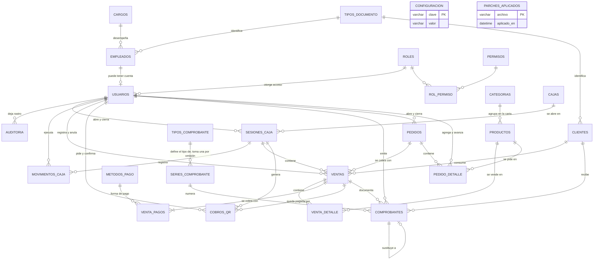

# 3. Diseño de la Base de Datos (MySQL 8)

**Proyecto:** Sistema de Restaurante
**Documento:** 03 — Modelo de datos
**Motor:** MySQL 8.0+ · InnoDB · `utf8mb4_0900_ai_ci`
**Scripts:** [`sql/01_schema_mysql.sql`](sql/01_schema_mysql.sql) · [`sql/02_datos_iniciales.sql`](sql/02_datos_iniciales.sql) · [`sql/parches/`](sql/parches/)

> La fuente de verdad es `01_schema_mysql.sql`. Este documento lo explica; si alguna vez se
> contradicen, manda el script.
>
> La base se llama **`ventas_db`**: son las ventas del restaurante, y es el nombre que usan
> los scripts, los parches y las pruebas. Renombrarla obligaría a migrar los datos sin ganar
> nada, porque vive en su propio contenedor.

---

## 3.1 Criterios de diseño

| # | Criterio | Aplicación |
|---|----------|------------|
| 1 | Normalización hasta 3FN | Catálogos separados (categorías, métodos de pago, tipos de comprobante, tipos de documento). Todo valor derivable dentro de la misma fila es **columna generada**, no una columna que alguien deba mantener. Auditoría completa en §3.4. |
| 2 | Desnormalización controlada | `venta_detalle` y `pedido_detalle` copian el nombre y el precio del plato. Un cambio de carta no altera ni las ventas emitidas ni los pedidos ya tomados. |
| 3 | Integridad referencial | Todas las relaciones entre entidades con `FOREIGN KEY`. `RESTRICT` por defecto, también del detalle a su cabecera (ventas y pedidos no se borran, y sin triggers nada impediría que un `DELETE` se llevara el detalle); `CASCADE` solo en la tabla puente `rol_permiso`. |
| 4 | Sin borrado físico | Catálogos con bandera `activo`; las ventas se anulan y los pedidos se cancelan, no se eliminan (dos triggers bloquean el `DELETE`). |
| 5 | Trazabilidad | Cada venta, pedido y línea de pedido guarda quién la registró; `auditoria` registra las operaciones sensibles. |
| 6 | Atomicidad | Venta, detalle, pagos y comprobante se escriben en una sola transacción InnoDB. La venta de mostrador abre el pedido, le carga los platos y lo cobra en esa misma transacción. |
| 7 | Precisión monetaria | `DECIMAL(12,2)` para dinero y `DECIMAL(12,3)` para cantidades. Nunca `FLOAT`. |
| 8 | Concurrencia | Las invariantes que dos personas podrían romper a la vez (dos turnos abiertos, dos ventas vigentes de un pedido, dos "pedido 7" en la misma jornada, dos comprobantes con el mismo número) las garantiza un **índice único**, no un `SELECT` previo de la aplicación. |

## 3.2 Diagrama Entidad-Relación

Las 26 tablas del modelo. El diagrama dibuja 34 líneas para 41 claves foráneas: siete pares
de FK unen el mismo par de tablas y se solapan (quién registra y quién anula una venta, quién
abre y quién cierra la caja, quién genera y quién confirma un cobro por QR, quién abre y
quién cierra un pedido, quién agrega una línea y quién mueve su estado en cocina, el
documento del cliente contra `tipos_documento` —una FK por tipo de persona— y la serie que
define su tipo frente a la serie por omisión de ese tipo).
`configuracion` y `parches_aplicados` aparecen sueltas a propósito: son parámetros del
negocio y registro técnico, y no se relacionan con ninguna otra.



**Cómo leer la cardinalidad:** `||--o{` uno a muchos (el hijo puede tener cero filas) ·
`||--|{` uno a muchos con al menos una fila (una venta sin detalle no existe) ·
`||--o|` uno a uno opcional (un empleado puede no tener cuenta; un comprobante sustituye como
mucho a otro).

> Un pedido puede tener **varias** ventas (`PEDIDOS ||--o{ VENTAS`): la que se anuló y la que
> lo volvió a cobrar. Vigente, una sola: lo garantiza `uq_venta_pedido_cobrado` (§3.5,
> `ventas`). Las ventas de antes de los pedidos no tienen pedido.

> Un pedido **sí** puede quedar sin líneas (`PEDIDOS ||--o{ PEDIDO_DETALLE`): dentro de la
> transacción de la venta de mostrador existe un instante entre abrirlo y cargarle el primer
> plato. Lo que no se puede es **cobrarlo** vacío, o con todo cancelado; eso lo controla la
> aplicación (HU-49).

## 3.3 Módulos y tablas

| Módulo | Tablas |
|--------|--------|
| Personal y seguridad | `cargos`, `empleados`, `roles`, `permisos`, `rol_permiso`, `usuarios` |
| Menú | `categorias`, `productos` |
| Clientes | `clientes` (persona natural / jurídica), `tipos_documento` (CI, NIT, CE, pasaporte, sin documento; también la usan `empleados`) |
| Caja | `cajas`, `sesiones_caja`, `movimientos_caja` |
| Comprobantes | `tipos_comprobante`, `series_comprobante`, **`comprobantes`**, `metodos_pago` |
| Ventas | `ventas`, `venta_detalle`, `venta_pagos`, `cobros_qr` |
| **Pedidos** | **`pedidos`**, **`pedido_detalle`** |
| Sistema | `configuracion`, `auditoria`, `parches_aplicados` |

**Total: 26 tablas, 3 vistas, 14 triggers y 6 procedimientos almacenados**, con 41 claves
foráneas, 44 restricciones `CHECK` y 17 columnas generadas.

> **"Menú" es el nombre de la pantalla, no de la tabla.** La interfaz dice *Menú* y la URL es
> `/menu`, pero por dentro siguen siendo la tabla `productos`, el modelo `Producto`, las rutas
> `productos.*` y el permiso `productos.gestionar`. Se cambió la etiqueta, no el esquema.

## 3.4 Auditoría de normalización (1FN → 3FN)

### Listado de tablas

| # | Tabla | Clave primaria | Veredicto |
|:-:|-------|----------------|----------|
| 1 | `cargos` | `id` | 3FN |
| 2 | `empleados` | `id` | 3FN — la persona y su vínculo laboral |
| 3 | `roles` | `id` | 3FN |
| 4 | `permisos` | `id` | 3FN |
| 5 | `rol_permiso` | `(rol_id, permiso_id)` | 3FN — tabla puente de N:M |
| 6 | `usuarios` | `id` | 3FN — solo credenciales y rol; 1:1 opcional con `empleados` |
| 7 | `categorias` | `id` | 3FN |
| 8 | `productos` | `id` | 3FN — el plato y su único precio |
| 9 | `clientes` | `id` | 3FN — subtipos natural/jurídica en una tabla con `CHECK` |
| 10 | `tipos_documento` | `codigo` | 3FN — catálogo de documentos de identidad; reemplaza tres `ENUM` repetidos |
| 11 | `cajas` | `id` | 3FN |
| 12 | `sesiones_caja` | `id` | 3FN — `diferencia` corregida a columna generada |
| 13 | `movimientos_caja` | `id` | 3FN |
| 14 | `tipos_comprobante` | `id` | 3FN — la serie por omisión pasó de `configuracion` a una FK |
| 15 | `series_comprobante` | `id` | 3FN |
| 16 | `metodos_pago` | `id` | 3FN |
| 17 | `ventas` | `id` | 3FN — `total` corregido a columna generada |
| 18 | `venta_detalle` | `id` | 3FN + copias históricas (justificadas) |
| 19 | `venta_pagos` | `id` | 3FN — `vuelto` corregido a columna generada |
| 20 | `cobros_qr` | `id` | 3FN — el cobro pendiente, con su propio ciclo de vida |
| 21 | `comprobantes` | `id` | 3FN — se eliminó `tipo_comprobante_id` |
| 22 | `pedidos` | `id` | 3FN + `jornada` guardada (justificada) |
| 23 | `pedido_detalle` | `id` | 3FN + copias históricas (justificadas) |
| 24 | `configuracion` | `clave` | 3FN — tabla de parámetros clave/valor |
| 25 | `auditoria` | `id` | 3FN — bitácora, solo inserción |
| 26 | `parches_aplicados` | `archivo` | 3FN — registro técnico de qué parches corrieron |

**26 tablas.** Ninguna tiene grupos repetitivos ni columnas multivaluadas (1FN), ninguna
clave primaria es compuesta salvo la tabla puente `rol_permiso` —cuyos dos atributos son la
clave completa, sin dependencias parciales (2FN)—, y tras las correcciones de abajo ningún
atributo no clave depende de otro atributo no clave (3FN).

### Violaciones encontradas y corregidas

| Tabla | Problema | Corrección |
|-------|----------|------------|
| `comprobantes` | Guardaba `tipo_comprobante_id` **y** `serie_id`, pero la serie ya determina el tipo (`serie_id → series_comprobante.tipo_comprobante_id → tipo`). Dependencia transitiva y dos fuentes de verdad que podían contradecirse. **La prueba del delito:** había un trigger dedicado a comprobar que ambas coincidieran. | Se eliminó la columna. El tipo se obtiene con `JOIN series_comprobante`. Desapareció esa validación del trigger y `sp_emitir_comprobante` pasó de 3 parámetros de entrada a 2. |
| `ventas` | `total` = `subtotal − descuento + impuesto`, los tres en la misma fila: dependencia entre atributos no clave. | `total` es **columna generada** `STORED`. Imposible desincronizar. |
| `comprobantes` | Mismo caso con su `total`. | Columna generada `STORED`. |
| `sesiones_caja` | `diferencia` = `monto_declarado − monto_esperado`, ambos en la misma fila. En un arqueo, una diferencia mal calculada es exactamente el dato que no se puede permitir. | Columna generada `STORED`. |
| `venta_pagos` | `vuelto` = `monto_recibido − monto`, ambos en la misma fila. | Columna generada `STORED` (0 cuando no hay `monto_recibido`, es decir, en pagos que no son en efectivo). |
| `pedido_detalle` | `importe` = `cantidad × precio_unitario`. | Columna generada `STORED`. |
| `pedidos` | `venta_id` guardaba 1 a 1 una relación que es 1 a N (el pedido puede tener la venta anulada y la que lo volvió a cobrar), y al anular se ponía en `NULL`: la venta anulada perdía de qué pedido era. `cliente_id` repetía `ventas.cliente_id` sin nada que los igualara. | La clave pasó a la venta (`ventas.pedido_id`), con una sola vigente por pedido (`uq_venta_pedido_cobrado`). El cliente queda solo en la venta. |
| `configuracion` | `serie_factura` y `serie_recibo` guardaban como texto el id de una serie: una clave foránea sin FK, que podía apuntar a una serie de otro tipo. | `tipos_comprobante.serie_por_omision_id`, con FK compuesta contra `series_comprobante (id, tipo_comprobante_id)`. |
| `clientes`, `empleados`, `comprobantes` | La lista de documentos de identidad repetida en tres `ENUM`, y en los `CHECK` de clientes. | Tabla `tipos_documento`; clientes y empleados la referencian con FK compuestas (ver `clientes`). |

### Separación de empleado, cargo, rol y usuario

En la primera versión, `usuarios` mezclaba tres cosas: la **persona** (nombres, apellidos,
documento, teléfono), la **cuenta** (usuario, contraseña, último acceso) y, de hecho, el
**cargo** — porque los roles llevaban nombres de puestos de trabajo, no de niveles de acceso.
Consecuencias: un empleado sin cuenta no podía existir, no había dónde anotar la fecha de
ingreso ni el cese, y `activo` significaba a la vez "cuenta deshabilitada" y "ya no trabaja
aquí".

Ahora son cuatro conceptos en cuatro tablas:

| Tabla | Responde a | Ejemplo |
|-------|-----------|---------|
| `cargos` | ¿Qué hace en el negocio? | Gerente, Cajero, Cocinero, Ayudante |
| `empleados` | ¿Quién es y bajo qué vínculo trabaja? | Luis Ramos, cajero, ingresó el 01/03/2025, contrato indefinido |
| `roles` | ¿Qué puede hacer en el sistema? | Administrador, Cajero, Cocina (conjuntos de permisos) |
| `usuarios` | ¿Con qué cuenta entra? | `cajero1`, rol Cajero, del empleado Luis Ramos |

- `empleados` → `usuarios` es **1:1 opcional**: `usuarios.empleado_id` es `NOT NULL` y
  `UNIQUE`, así que toda cuenta pertenece a un empleado y ningún empleado tiene dos cuentas,
  pero un empleado puede no tener ninguna (en los datos de ejemplo, el ayudante Jorge
  —el que lleva los platos— trabaja sin usar el sistema).
- **Cargo y rol quedan independientes.** El cargo "Cajero" y el rol "Cajero" se llaman igual
  pero dicen cosas distintas: un cajero de confianza puede tener rol Administrador sin dejar
  de ser cajero, y un ayudante puede tener rol Cajero sin dejar de ser ayudante.
- `empleados.estado` (`ACTIVO` / `SUSPENDIDO` / `CESADO`) es el vínculo laboral;
  `usuarios.activo` es el acceso. El trigger `trg_empleados_after_update` hace que el primero
  mande sobre el segundo: al cesar o suspender a alguien, su cuenta se desactiva sola. Al
  revés no ocurre — quitarle el acceso a alguien no lo despide.
- Dos `CHECK` mantienen coherente el cese: `CESADO` exige `fecha_cese`, y una `fecha_cese`
  exige estado `CESADO`; además el cese no puede ser anterior al ingreso.

Toda la trazabilidad del sistema (`ventas.usuario_id`, `pedidos.usuario_id`,
`pedido_detalle.actualizado_por`, `sesiones_caja.usuario_apertura_id`,
`comprobantes.emitido_por`, `auditoria.usuario_id`…) **apunta a `usuarios`**, que es lo
correcto: quien ejecuta una operación es una cuenta, no una persona. El nombre para mostrar
se obtiene con un JOIN a `empleados`.

### Desnormalizaciones deliberadas (y por qué se quedan)

Estas **no** son errores: son datos históricos o agregados con una razón concreta. La regla
que las separa de una redundancia es que el valor guardado **no siempre coincide** con el
que se calcularía hoy, y eso es justamente lo que se quiere.

| Dato | Se podría derivar de | Por qué se guarda |
|------|----------------------|-------------------|
| `pedido_detalle.descripcion`, `precio_unitario` | `productos` | Es el nombre y el precio **del momento en que el cliente pidió**. Si la carta sube a media tarde, el pedido conserva lo que se le cobró al pedir. |
| `pedido_detalle.pasa_por_cocina` | `productos` → `categorias.pasa_por_cocina` | Si la línea va a la cocina **según su sección el día que se pidió**. Cambiar la sección después no hace aparecer ni desaparecer de la cocina lo ya pedido. |
| `pedidos.jornada` | `fecha_apertura` y `configuracion.hora_corte_jornada` | La jornada **con la que se numeró** el pedido. Si el administrador cambia la hora de corte, los pedidos ya numerados no se mudan de jornada: sus números están impresos en tickets que el cliente se llevó, y recalcularlos podía juntar dos "pedido 1" en la misma jornada y romper `uq_pedido_numero_dia`. |
| `venta_detalle.descripcion`, `precio_unitario`, `afecto_impuesto`, `tasa_impuesto`, `impuesto_incluido` | `productos`, `configuracion` y `ventas` | Es el precio, el nombre y el régimen de impuesto **del día de la venta**. Un comprobante reimpreso tiene que decir lo mismo que el que se entregó en mano. |
| `comprobantes.*` (nombre, documento, dirección, importes del cliente) | `clientes` y `ventas` | Un documento contable es inmutable: si el cliente cambia de razón social, la factura emitida no se altera. |
| `comprobantes.emisor_nombre`, `emisor_documento`, `emisor_direccion`, `emisor_telefono` | `configuracion` (`negocio_*`) | Los datos **del negocio** al emitir. Si el local cambia de nombre o de NIT, un comprobante viejo se reimprime como se entregó, no con los datos de hoy. |
| `comprobantes.numero_completo` | `serie` + `numero` + `longitud` | El número impreso en el papel. Si mañana cambia el formato de la serie, el documento ya emitido conserva el suyo. |
| `ventas.subtotal`, `descuento`, `impuesto` | `SUM` sobre `venta_detalle` | Agregado de otra tabla; lo recalcula `sp_recalcular_venta`. Evita agregaciones en cada listado de ventas. |

### Lo que decidí no cambiar (y la alternativa)

- **`clientes` con subtipos en una sola tabla.** Un purista separaría en `clientes` +
  `clientes_natural` + `clientes_juridica` para eliminar las columnas nulas. No lo hice: son
  seis columnas opcionales, los dos `CHECK` ya impiden un registro incoherente, y el cobro
  necesita el cliente completo en **cada** venta — dos JOIN extra por operación a cambio de
  pureza formal. Las columnas nulas por subtipo no violan 3FN.
- **`pedido_detalle` sin índice único por producto**, a diferencia de `venta_detalle`. El
  mostrador hoy manda una línea por plato, pero cada línea lleva su nota, su hora y su estado
  en la cocina: un índice único ataría la cocina a una sola nota por plato. El cobro agrupa por producto antes de pasar las líneas a la venta.
- **`cantidad` es `DECIMAL(12,3)`** aunque todo se despacha por porción entera: deja abierta
  la puerta a vender algo al peso sin migrar la tabla. Que hoy sea entera lo valida la
  aplicación (`App\Services\Ventas` y `App\Services\Pedidos`), y en `pedido_detalle` lo exige
  además `ck_pedidodet_entera`.
- **`auditoria.(entidad, entidad_id)` es una referencia sin clave foránea**, y es la única
  del esquema. Es deliberado: la bitácora anota operaciones sobre tablas distintas (ventas,
  pedidos, líneas de pedido, comprobantes), incluidas filas que ya no existen, como las de
  las tablas que retiraron los parches del 17/09. Una FK obligaría a conservar la fila
  solo para que la bitácora pueda nombrarla.

Fuera de la bitácora, **ninguna relación del esquema queda fuera del control del motor**.
(`comprobantes.cliente_tipo_documento` guarda un código de `tipos_documento` sin FK, pero no
es una referencia: es la foto del código tal como era al emitir.)

## 3.5 Diccionario de datos (tablas centrales)

### `empleados`

| Columna | Tipo | Nulo | Descripción |
|---------|------|:----:|-------------|
| `id` | INT UNSIGNED PK | No | Identificador |
| `cargo_id` | INT FK | No | Puesto que desempeña (`cargos`) |
| `tipo_documento`, `documento` | VARCHAR(5) FK + VARCHAR(20) | No | `CI`, `CE`, `PAS`: los de `tipos_documento` con `aplica_empleado = 1`; únicos en conjunto (`uq_empleados_documento`) |
| `nombres`, `apellidos` | VARCHAR(60) | No | Datos de la persona |
| `fecha_nacimiento`, `telefono`, `email`, `direccion` | — | Sí | Datos de contacto |
| `fecha_ingreso` | DATE | No | Inicio del vínculo laboral |
| `fecha_cese`, `motivo_cese` | DATE + VARCHAR | Sí | Solo si `estado = 'CESADO'` |
| `tipo_contrato` | ENUM | No | `INDEFINIDO`, `PLAZO_FIJO`, `PARCIAL`, `PRACTICAS` |
| `estado` | ENUM | No | `ACTIVO`, `SUSPENDIDO`, `CESADO` — **vínculo laboral**, no acceso |
| `nombre_completo` | VARCHAR(130) | No | **Columna generada**: `nombres + apellidos` |
| `tipodoc_empleado` | TINYINT(1) | No | **Columna generada**, siempre 1: con `tipo_documento` forma la FK `fk_empleados_tipodoc` contra `tipos_documento (codigo, aplica_empleado)` |

Los ids de `cargos`, `roles` y `cajas` son `INT UNSIGNED` (hasta el 19/09 eran `TINYINT`, 255
como máximo). Ningún negocio llega a 255 cajas, pero el `AUTO_INCREMENT` no vuelve atrás
cuando una transacción se deshace, y la base de pruebas llegó al tope; en un servidor real
pasaría lo mismo con cualquier alta que fallara a mitad.

### `usuarios`

| Columna | Tipo | Nulo | Descripción |
|---------|------|:----:|-------------|
| `id` | INT UNSIGNED PK | No | Identificador; es el que referencia toda la trazabilidad |
| `empleado_id` | INT FK **UQ** | No | Persona dueña de la cuenta; el índice único impide dos cuentas por empleado |
| `rol_id` | INT FK | No | Rol de acceso (conjunto de permisos) |
| `usuario` | VARCHAR(40) UQ | No | Nombre de inicio de sesión |
| `password_hash` | VARCHAR(255) | No | Hash de la contraseña (RNF4) |
| `password_actualizado_en` | DATETIME | Sí | Último cambio de contraseña |
| `debe_cambiar_password` | TINYINT(1) | No | 1 = la contraseña la puso otro (la instalación o un administrador): se pide cambiarla al entrar |
| `activo` | TINYINT(1) | No | **Acceso al sistema**, distinto de `empleados.estado` |
| `ultimo_acceso`, `intentos_fallidos` | — | — | Control de sesión y bloqueo |

### Roles y permisos de fábrica

| Rol | Permisos | Qué hace |
|-----|----------|----------|
| Administrador | Todos | Administra el local, cierra la caja, anula, ve reportes |
| Cajero | `ventas.registrar`, `caja.abrir`, `pedidos.registrar` | Abre su turno, **toma el pedido y lo cobra en el mismo acto**, vuelve a cobrar o cancela el pedido de una venta anulada. **No** cierra la caja |
| Cocina | `cocina.ver` | Ve la pantalla de cocina, mueve el estado de cada plato, entrega el pedido e imprime la comanda. Nada de dinero |

Los permisos completos son 15: `usuarios.gestionar`, `empleados.gestionar`,
`productos.gestionar`, `ventas.registrar`, `ventas.anular`, `ventas.descuento`,
`pedidos.registrar`, `cocina.ver`, `caja.abrir`, `caja.cerrar`, `reportes.ver`,
`configuracion.editar`, `bitacora.ver`, `clientes.editar` y `registros.eliminar`.
**Respaldos no es un permiso**: no tiene pantalla. Los hace el programador de tareas cada
noche, por debajo, para que nadie del local —ni el administrador— pueda llevarse la base
entera desde el navegador (parche 18). Los roles son editables desde la aplicación; la tabla de arriba es lo
que siembra `02_datos_iniciales.sql`. El id 3 del rol y el del cargo quedan sin usar, para
que los demás conserven su número en todas las bases.

`pedidos.registrar` ya no abre pedidos —eso lo hace la venta, con `ventas.registrar`—: sirve
para **cancelar el pedido de una venta anulada, o uno de sus platos**, mientras espera volver
a cobrarse. Si la cocina ya empezó algo, cancelar el pedido exige además `ventas.anular`, y
cancelar un plato que ya está **en preparación** también, con su motivo: con los roles de
fábrica, solo lo hace el administrador (§3.6).

### `categorias` (las secciones de la carta)

| Columna | Tipo | Nulo | Descripción |
|---------|------|:----:|-------------|
| `id` | SMALLINT UNSIGNED PK | No | Identificador |
| `nombre` | VARCHAR(60) UQ | No | Entradas, Platos de fondo, Bebidas, Postres |
| `descripcion` | VARCHAR(200) | Sí | Descripción de la sección |
| `activo` | TINYINT(1) | No | Baja lógica |
| `pasa_por_cocina` | TINYINT(1) | No | 1 = lo de esta sección se prepara en la cocina. **Bebidas en 0** en los datos de ejemplo: se cobran, pero no van a la pantalla de la cocina ni a la comanda |
| `creado_en` | TIMESTAMP | No | Alta |

### `productos` (los platos del menú)

| Columna | Tipo | Nulo | Descripción |
|---------|------|:----:|-------------|
| `id` | INT UNSIGNED PK | No | Identificador |
| `categoria_id` | SMALLINT FK | No | Sección de la carta: Entradas, Platos de fondo, Bebidas, Postres |
| `codigo` | VARCHAR(30) UQ | No | Código interno (`P-0010`): lo que se teclea para encontrar el plato rápido |
| `nombre` | VARCHAR(120) | No | Nombre en la carta |
| `descripcion` | VARCHAR(255) | Sí | Descripción del plato |
| `precio_venta` | DECIMAL(12,2) | No | **El único precio del plato.** Con la configuración por omisión es la base **sin impuesto** (ver §3.5 «Cálculo del impuesto») |
| `afecto_impuesto` | TINYINT(1) | No | 1 = se le aplica el impuesto al vender |
| `imagen` | VARCHAR(255) | Sí | Ruta de la foto del plato |
| `activo` | TINYINT(1) | No | 0 = fuera de carta (baja lógica, HU-07) |

`CHECK ck_productos_precios (precio_venta >= 0)`. No hay stock, ni unidad de medida, ni
código de barras, ni precio de compra (§3.3).

### `pedidos` (lo que un cliente pidió en el mostrador)

El local atiende en el mostrador: el cliente pide y paga en la caja —primero se paga—, se
lleva un ticket con el número del pedido y se sienta donde quiera, o espera para llevar. Cada
venta del punto de venta es un pedido, que se abre, se carga y se cobra en la misma
transacción (`App\Services\Pedidos::venderEnMostrador`).

| Columna | Tipo | Nulo | Descripción |
|---------|------|:----:|-------------|
| `id` | BIGINT UNSIGNED PK | No | Clave; es lo que va en las direcciones, no lo que se lee en voz alta |
| `tipo` | ENUM | No | `LOCAL` ("comer aquí", por omisión) o `LLEVAR` |
| `numero_dia` | SMALLINT UNSIGNED | No | **El número que se canta al entregar**: 1, 2, 3… y vuelve a 1 en cada jornada. Un solo contador para comer aquí y para llevar |
| `jornada` | DATE | No | La jornada del local a la que pertenece el pedido (ver abajo). Columna **normal** que escribe la aplicación |
| `usuario_id` | INT FK | No | Quien lo abrió: el cajero que tomó el pedido |
| `nombre_cliente` | VARCHAR(80) | Sí | A quién llamar cuando esté. El cliente registrado, si lo hay, es de la venta (`ventas.cliente_id`) |
| `estado` | ENUM | No | `ABIERTO` (cobro anulado, para volver a cobrar), `CERRADO` (cobrado) o `CANCELADO` |
| `observacion` | VARCHAR(255) | Sí | Nota general del pedido |
| `motivo_cancelacion` | VARCHAR(255) | Sí | Obligatorio si `estado = 'CANCELADO'` |
| `fecha_apertura` | DATETIME | No | Momento en que se tomó el pedido |
| `fecha_cierre` | DATETIME | Sí | Cobro o cancelación; `NULL` mientras espera volver a cobrarse |
| `cerrado_por` | INT FK | Sí | Quién lo cobró o lo canceló |
| `creado_en` | TIMESTAMP | No | Alta de la fila |

**Cuándo un pedido está `ABIERTO`.** En el mostrador, solo dentro de la transacción de la
venta: sale de ella `CERRADO`, o no sale. El único pedido que queda abierto a la vista es el
que se **reabre al anular su venta** (`Pedidos::reabrirTrasAnular`): el cliente ya tiene su
ticket y la cocina ya lo prepara, así que se vuelve a cobrar con el mismo número y sus
mismas líneas, o se cancela.

**El pedido no guarda su venta: la venta guarda su pedido** (`ventas.pedido_id`). Un pedido
puede tener varias ventas —la que se anuló y la que lo volvió a cobrar— y la anulada tiene que
seguir diciendo de qué pedido era. Que un pedido se cobre **una sola vez** lo garantiza
`uq_venta_pedido_cobrado`, en `ventas`. «Pedido `CERRADO` ⇔ tiene una venta `COMPLETADA`» ya
no cabe en un `CHECK` (son dos tablas): lo garantiza `App\Services\Pedidos`, que cierra el
pedido en la misma transacción en que registra su venta y lo reabre en la misma en que la
anula.

**Índices únicos**

| Índice | Columnas | Garantiza |
|--------|----------|-----------|
| `uq_pedido_numero_dia` | `(jornada, numero_dia)` | **No hay dos "pedido 7" en la misma jornada**, aunque dos cajeros cobren en el mismo segundo. |

Además: `ix_pedidos_estado (estado, fecha_apertura)` para los pedidos que hay que volver a
cobrar e
`ix_pedidos_usuario`.

**Restricciones `CHECK`**

```sql
-- abierto es no tener fecha de cierre: la misma cosa dicha dos veces
CONSTRAINT ck_pedidos_cierre CHECK ((estado = 'ABIERTO') = (fecha_cierre IS NULL)),
-- cancelar exige explicar por qué
CONSTRAINT ck_pedidos_cancel CHECK (estado <> 'CANCELADO' OR motivo_cancelacion IS NOT NULL),
-- el contador de la jornada empieza en 1: un «pedido 0» no se canta
CONSTRAINT ck_pedidos_numero CHECK (numero_dia > 0)
```

**La jornada.** El local cierra pasada la medianoche, y el pedido de la 01:30 del 19 es de la
noche del 18: sigue su numeración, no empieza otra. `jornada` es la fecha de la apertura
menos `configuracion.hora_corte_jornada` horas (5 por omisión, de 0 a 12), y la calcula
`App\Support\Config::jornadaDe()`. No es columna generada porque una columna generada no
puede leer la configuración. Los pedidos anteriores al parche del 18/09 conservan como
jornada el día de su apertura, que es con lo que se numeraron (§3.11).

**Cómo se asigna el número.** `App\Services\Pedidos::abrir()` toma el siguiente dentro de la
transacción de apertura:

```sql
SELECT COALESCE(MAX(numero_dia), 0) + 1 FROM pedidos WHERE jornada = ? FOR UPDATE;
```

El bloqueo cae sobre el tramo de `uq_pedido_numero_dia` de esa jornada —el índice empieza por
`jornada`—, así que el segundo cajero espera y lee un máximo que ya incluye al primero. Si
aun así el índice rechaza el número, el servicio reintenta (hasta 3 veces), igual que
`Ventas::registrar()` ante un deadlock. Es el mismo criterio que `sp_siguiente_comprobante`
con el correlativo. El comprobante impreso lleva `numero_dia`, no el `id` (HU-52).

### `pedido_detalle` (lo que se pidió, línea por línea)

| Columna | Tipo | Nulo | Descripción |
|---------|------|:----:|-------------|
| `id` | BIGINT UNSIGNED PK | No | Identificador |
| `pedido_id` | BIGINT FK | No | Pedido al que pertenece (`ON DELETE RESTRICT`: los pedidos no se borran) |
| `producto_id` | INT FK | No | Plato pedido |
| `descripcion` | VARCHAR(120) | No | **Copia histórica** del nombre del plato |
| `cantidad` | DECIMAL(12,3) | No | Porciones (> 0 y enteras) |
| `precio_unitario` | DECIMAL(12,2) | No | **Copia** del precio al momento de pedir |
| `importe` | DECIMAL(12,2) | No | **Columna generada**: `ROUND(cantidad × precio_unitario, 2)` |
| `nota` | VARCHAR(255) | Sí | Nota para la cocina: "sin cebolla", "término medio" |
| `pasa_por_cocina` | TINYINT(1) | No | **Copia** de `categorias.pasa_por_cocina` al pedirse: 0 = no va a la pantalla de la cocina ni a la comanda |
| `estado_cocina` | ENUM | No | `PENDIENTE`, `EN_PREPARACION`, `LISTO`, `ENTREGADO`, `CANCELADO` |
| `usuario_id` | INT FK | No | Quién agregó la línea |
| `actualizado_por` | INT FK | Sí | Quién movió su estado por última vez |
| `comandado_en` | TIMESTAMP | Sí | Cuándo salió en una comanda impresa. La comanda trae solo lo que todavía no salió; una reimpresión no lo toca |
| `cancelacion_comandada_en` | TIMESTAMP | Sí | Cuándo salió en papel el aviso de que se canceló, para avisarlo una sola vez |
| `creado_en` | TIMESTAMP | No | Hora del pedido: es lo que ordena la cocina |
| `actualizado_en` | TIMESTAMP | No | Último cambio en la cocina (imprimir la comanda no lo toca) |

`CHECK ck_pedidodet_cantidad (cantidad > 0)`, `ck_pedidodet_precio (precio_unitario >= 0)` y
`ck_pedidodet_entera (cantidad = FLOOR(cantidad))`: todo va por porción.
Índices: `ix_pedidodet_pedido`, `ix_pedidodet_producto` e `ix_pedidodet_cocina
(estado_cocina, creado_en)`, que es exactamente como lee la pantalla de la cocina: por
estado y en orden de llegada.

**El recorrido de una línea por la cocina** (lo aplica la aplicación, no la base):

```
PENDIENTE ──► EN_PREPARACION ──► LISTO ──► ENTREGADO
    │               │
    └──► LISTO      └──► CANCELADO
    └──► CANCELADO
```

No se vuelve atrás: si la cocina se adelantó, queda escrito lo que pasó. Ninguna línea se
borra: lo que ya no se quiere se **cancela**, y solo mientras el pedido espera volver a
cobrarse; de un pedido ya cobrado no se cancela nada —el dinero ya entró—, se anula la venta.
Cancelar lo hace la caja, no la cocina; y una línea `EN_PREPARACION` solo la cancela el
administrador (`ventas.anular`), con su motivo. Las líneas `CANCELADO` no se cobran.

Lo que no pasa por la cocina (`pasa_por_cocina = 0`) se queda `PENDIENTE` mientras el pedido
espera volver a cobrarse —en la pantalla de cobro se lee "Sin cocina"— y pasa a `ENTREGADO` al cobrarse,
sin recorrer el camino de arriba: se entrega con el ticket.

### `ventas`

| Columna | Tipo | Nulo | Descripción |
|---------|------|:----:|-------------|
| `id` | BIGINT UNSIGNED PK | No | Identificador |
| `cliente_id` | INT FK | Sí | `NULL` = cliente varios (cobro sin cliente) |
| `usuario_id` | INT FK | No | Cajero que registró la venta |
| `sesion_caja_id` | INT FK | No | Turno de caja al que pertenece (HU-28) |
| `pedido_id` | BIGINT FK | Sí | El pedido que cobró. Lo conserva aunque se anule; `NULL` solo en las ventas de antes de los pedidos |
| `fecha` | DATETIME | No | Fecha y hora del servidor |
| `subtotal` | DECIMAL(12,2) | No | Base imponible: suma del detalle, **sin impuesto** |
| `descuento` | DECIMAL(12,2) | No | La parte del descuento que baja la base |
| `impuesto` | DECIMAL(12,2) | No | Impuesto de las líneas, en la proporción de la base que deja el descuento |
| `impuesto_incluido` | TINYINT(1) | No | 1 = la venta se registró con precios que ya traen el impuesto |
| `descuento_precio_final` | DECIMAL(12,2) | Sí | Con impuesto incluido: el descuento tal como lo vio el cliente, sobre el precio final |
| `total` | DECIMAL(12,2) | No | **Columna generada**: `subtotal − descuento + impuesto` |
| `estado` | ENUM | No | `COMPLETADA` o `ANULADA`. No hay estados de devolución |
| `observacion` | VARCHAR(255) | Sí | Nota de la venta |
| `anulada_en`, `anulada_por`, `motivo_anulacion` | — | Sí | Rastro de la anulación (HU-29) |
| `pedido_cobrado_uk` | BIGINT | Sí | **Columna generada** `VIRTUAL`: `IF(estado = 'COMPLETADA', pedido_id, NULL)`. Con `uq_venta_pedido_cobrado`, **una sola venta vigente por pedido**, aunque dos cajeros pulsen "Cobrar" a la vez; las anuladas no ocupan lugar |

Restricciones `CHECK`:

```sql
CONSTRAINT ck_ventas_montos  CHECK (subtotal >= 0 AND descuento >= 0 AND impuesto >= 0
                                    AND descuento <= subtotal),
-- anulada es tener cuándo, quién y por qué; una completada no tiene nada de eso
CONSTRAINT ck_ventas_anulacion CHECK ((estado = 'ANULADA') = (anulada_en IS NOT NULL)
                                      AND (anulada_en IS NULL) = (anulada_por IS NULL)
                                      AND (anulada_en IS NULL) = (motivo_anulacion IS NULL)),
-- el descuento sobre el precio final solo existe con el impuesto incluido
CONSTRAINT ck_ventas_precio_final CHECK (impuesto_incluido = 1 OR descuento_precio_final IS NULL)
```

> El número de documento **no vive en `ventas`**: la venta es la operación comercial y el
> documento entregado al cliente está en `comprobantes`. El pedido, en cambio, sí: la venta
> que salió de un pedido lo dice en `pedido_id`, y lo sigue diciendo después de anulada.
> Toda venta del mostrador sale de un pedido; `pedido_id` admite nulo para las que se
> registren por otra vía.

### `clientes` (persona natural / jurídica)

Un solo maestro con el discriminador `tipo_persona`. Las columnas propias de cada tipo son
nulas para el otro, y dos `CHECK` impiden que un cliente quede a medio llenar.

| Columna | Tipo | Aplica a | Descripción |
|---------|------|----------|-------------|
| `tipo_persona` | ENUM | ambos | `NATURAL` o `JURIDICA` |
| `tipo_documento` | VARCHAR(5) FK | ambos | Código de `tipos_documento`: `CI`, `CE`, `PAS`, `SIN`, `NIT` (natural) · `NIT` (jurídica) |
| `documento` | VARCHAR(20) | ambos | Único junto con `tipo_documento` |
| `nombres`, `apellidos` | VARCHAR(60) | natural | Obligatorios si `tipo_persona = 'NATURAL'` |
| `fecha_nacimiento` | DATE | natural | Opcional |
| `razon_social` | VARCHAR(150) | jurídica | Obligatoria si `tipo_persona = 'JURIDICA'` |
| `nombre_comercial` | VARCHAR(120) | jurídica | Opcional |
| `representante_legal` | VARCHAR(120) | jurídica | Se imprime en la factura |
| `direccion` | VARCHAR(200) | ambos | **Obligatoria** para persona jurídica (dirección fiscal) |
| `telefono`, `email`, `activo` | — | ambos | Contacto y baja lógica |
| `nombre` | VARCHAR(150) | ambos | **Columna generada**: razón social, o `nombres + apellidos` |
| `tipodoc_natural`, `tipodoc_juridica` | TINYINT(1) | ambos | **Columnas generadas**: 1 en la de su tipo de persona y `NULL` en la otra. Con `tipo_documento` forman las FK contra `tipos_documento (codigo, aplica_natural)` y `(codigo, aplica_juridica)`; la FK con `NULL` no se comprueba, así que cada cliente pasa por la suya |

Reglas garantizadas por la base de datos:

```sql
-- ck_clientes_natural
tipo_persona = 'NATURAL'  → nombres y apellidos obligatorios, razon_social nula;
                            con NIT, el número es obligatorio

-- ck_clientes_juridica
tipo_persona = 'JURIDICA' → razon_social, documento y direccion obligatorios,
                            nombres y apellidos nulos

-- fk_clientes_tipodoc_natural / fk_clientes_tipodoc_juridica
qué documento vale para cada tipo de persona lo dice tipos_documento
(natural: CI, NIT, CE, PAS, SIN · jurídica: solo NIT)
```

Una persona natural **puede** tener NIT (unipersonal, profesional independiente): con él
recibe factura a su nombre. La columna generada `nombre` permite que listados, búsquedas y
comprobantes usen un solo campo sin preguntar de qué tipo de cliente se trata.

### `tipos_documento` (documentos de identidad)

Hasta el 19/09 eran tres `ENUM` repetidos (clientes, empleados y comprobantes). La clave es
el código, el mismo que se imprime y se busca: clientes y empleados siguen guardando `CI` o
`NIT`, y un documento nuevo es una fila, no un `ALTER`.

| Código | Nombre | `aplica_natural` | `aplica_juridica` | `aplica_empleado` |
|--------|--------|:----------------:|:-----------------:|:-----------------:|
| `CI` | CI (cédula de identidad) | Sí | No | Sí |
| `NIT` | NIT | Sí | Sí | No |
| `CE` | Carné de extranjería | Sí | No | Sí |
| `PAS` | Pasaporte | Sí | No | Sí |
| `SIN` | Sin documento | Sí | No | No |

Las banderas dicen para quién vale cada uno, y clientes y empleados lo exigen con una FK
compuesta contra `(codigo, aplica_*)` —los índices únicos `uq_tipodoc_natural`,
`uq_tipodoc_juridica` y `uq_tipodoc_empleado` son los que la FK necesita—: la regla vive en
esta tabla y en ningún otro lado. `orden` fija cómo se ofrecen en pantalla.

### `comprobantes` (factura / recibo)

Apartado donde se guarda el documento entregado al cliente. Una venta tiene como máximo **un**
comprobante vigente.

| Columna | Tipo | Descripción |
|---------|------|-------------|
| `venta_id` | BIGINT FK | Venta documentada |
| `serie_id`, `numero` | FK + INT | Serie y correlativo; únicos en conjunto (`uq_comprobante_numero`, HU-13). **La serie determina el tipo** (`FAC`, `REC`, `NV`): no se guarda el tipo aparte |
| `numero_completo` | VARCHAR(20) | Número formateado, ej. `F001-000126`, `R001-000341` |
| `fecha_emision` | DATETIME | Fecha del documento |
| `emisor_nombre`, `emisor_documento`, `emisor_direccion`, `emisor_telefono` | VARCHAR | **Foto** de los datos del negocio (`configuracion.negocio_*`) al emitir. La llena `sp_emitir_comprobante` (y su gemelo en PHP) |
| `cliente_id` | INT FK | Cliente al que se emitió (`NULL` si se cobró sin cliente) |
| `tipo_persona` | ENUM | **Foto** del tipo de cliente al emitir |
| `cliente_nombre` | VARCHAR(150) | **Foto** de la razón social o nombre completo |
| `cliente_tipo_documento`, `cliente_documento` | VARCHAR(5) + VARCHAR(20) | **Foto** del NIT/CI (`SIN` si no hay cliente). El código va **sin FK** a `tipos_documento`: es el que era al emitir |
| `cliente_direccion` | VARCHAR(200) | **Foto** de la dirección fiscal |
| `representante_legal` | VARCHAR(120) | **Foto**, solo persona jurídica |
| `subtotal`, `descuento`, `impuesto` | DECIMAL(12,2) | **Foto** de los importes |
| `total` | DECIMAL(12,2) | **Columna generada** |
| `moneda` | VARCHAR(3) | Código ISO tomado de `configuracion.moneda_codigo` (`BOB` por omisión) |
| `estado` | ENUM | `EMITIDO` (vigente), `ANULADO` (venta anulada) o `SUSTITUIDO` (reemplazado por otro) |
| `anulado_en`, `motivo_anulacion` | — | Rastro de la anulación del documento |
| `sustituye_a` | BIGINT FK self | Documento al que reemplaza (HU-42) |
| `sustituido_en` | DATETIME | Momento en que dejó de ser el vigente |
| `motivo_emision` | VARCHAR(255) | Por qué se emitió este reemplazo |
| `emitido_por` | INT FK | Usuario que emitió el documento |
| `observacion` | VARCHAR(255) | Nota |
| `venta_vigente_uk` | Generada `VIRTUAL` + UQ | `venta_id` solo si `estado = 'EMITIDO'`: garantiza **un único comprobante vigente por venta** (`uq_comprobante_vigente`) |

Además de `ck_comprobante_montos`, el estado y su fecha no pueden contradecirse:

```sql
CONSTRAINT ck_comprobante_anulado    CHECK ((estado = 'ANULADO') = (anulado_en IS NOT NULL)),
CONSTRAINT ck_comprobante_sustituido CHECK ((estado = 'SUSTITUIDO') = (sustituido_en IS NOT NULL))
```

**Por qué se guarda una foto y no solo la relación:** un comprobante es un documento
contable. Si mañana el cliente cambia de razón social o de dirección fiscal, la factura ya
emitida no puede cambiar con él. Lo mismo aplica a los importes y a los datos del propio
negocio: antes del 19/09 se imprimían los datos **actuales** de `configuracion`, y un
comprobante viejo se reimprimía con el nombre o el NIT de hoy. Los comprobantes que ya
existían al aplicar el parche se llenaron con los datos de ese día: el del día en que se
emitieron no se había guardado en ningún lado.

### Cobro sin cliente registrado

Es el caso de casi todos los pedidos, y el modelo lo trata como el camino normal, no como una
excepción:

- `ventas.cliente_id` es **NULL** y `comprobantes.cliente_id` también.
- El comprobante se emite igual, a nombre del texto configurado en
  `configuracion.cliente_generico_nombre` (por defecto "Cliente varios"), con
  `cliente_tipo_documento = 'SIN'` y `cliente_documento = NULL`.
- El tipo de documento aplicable es el **recibo** (`exige_cliente = 0`), o la nota de venta.

**Una sola forma de representarlo.** No existe un registro semilla "Cliente varios" en la
tabla `clientes`. Tener las dos cosas —un cliente ficticio y el `NULL`— significa que la
mitad de las ventas anónimas quedarían apuntando a un cliente falso: ese registro terminaría
encabezando el reporte de mejores clientes y ensuciando el historial. La regla es: **sin
cliente identificado, `cliente_id = NULL`**; el nombre genérico es un texto de impresión, no
una persona.

```sql
-- correcto: LEFT JOIN, porque el cliente puede no existir
SELECT v.id, v.total, IFNULL(c.nombre, 'Cliente varios') AS cliente
  FROM ventas v LEFT JOIN clientes c ON c.id = v.cliente_id;
```

**Único caso en que el cajero está obligado a pedir datos:** si el cliente pide **factura**.
`tipos_comprobante.FAC` tiene `exige_cliente = 1` y `exige_documento = 1`. Si la pide
**después** de emitido el recibo, se **sustituye** el comprobante (HU-42, ver más abajo).

### `tipos_comprobante`

| Código | Nombre | `aplica_persona` | `exige_cliente` | `exige_documento` |
|--------|--------|------------------|:---------------:|:-----------------:|
| `FAC` | Factura | `JURIDICA` | Sí | Sí (NIT) |
| `REC` | Recibo | `NATURAL` | No | No |
| `NV` | Nota de venta | `AMBAS` | No | No |

Estas tres banderas son las que el trigger `trg_comprobantes_before_insert` usa para decidir
si el documento puede emitirse. Series sembradas: `F001`, `R001` y `NV01`.

`serie_por_omision_id` es la serie con que se numera cada tipo; cada serie sembrada es la
de su tipo. Antes eran dos claves de texto en `configuracion` (`serie_factura` y
`serie_recibo`) y la de la nota de venta salía de otra consulta. La FK es compuesta,
`(serie_por_omision_id, id)` contra `series_comprobante (id, tipo_comprobante_id)`: la base
impide elegir la serie de los recibos como serie de facturas.

### Sustitución de comprobante (recibo → factura)

El caso real: el pedido se cobró sin cliente y salió con recibo; al rato vuelve el comensal y
dice que era un almuerzo de trabajo y necesita factura. **No se anula la venta** —la comida
se sirvió y el dinero entró— solo cambia el documento.

`sp_sustituir_comprobante(comprobante, serie, cliente, usuario, motivo)` hace:

1. Valida que el documento esté **vigente** (`estado = 'EMITIDO'`) y que la venta esté
   `COMPLETADA` — no se sustituye el documento de una venta anulada.
2. Valida la ventana de tiempo: `configuracion.dias_max_sustitucion` (1 día por defecto).
3. Asigna el cliente a la venta (`ventas.cliente_id`), si se indicó uno.
4. Marca el documento anterior como `SUSTITUIDO` con su `sustituido_en`. Esto **libera el
   índice único**, porque `venta_vigente_uk` solo tiene valor mientras el estado es `EMITIDO`.
5. Emite el documento nuevo con su **propio correlativo** (nunca se reutiliza un número), y
   el trigger valida que el cliente corresponda.
6. Enlaza el nuevo con el anterior (`sustituye_a`), con el motivo y el usuario, y escribe
   en `auditoria` (`SUSTITUIR_COMPROBANTE`).

| numero_completo | estado | sustituye_a | sustituido_en |
|---|---|---|---|
| `R001-000002` | `SUSTITUIDO` | — | 2026-09-18 13:40 |
| `F001-000002` | `EMITIDO` | `R001-000002` | — |

La cadena completa se sigue por `sustituye_a`, y quien liste ventas con su documento filtra
`estado <> 'SUSTITUIDO'` para que una venta no aparezca dos veces.

### `venta_detalle`

| Columna | Tipo | Nulo | Descripción |
|---------|------|:----:|-------------|
| `venta_id` | BIGINT FK | No | Venta a la que pertenece (`ON DELETE RESTRICT`: las ventas no se borran) |
| `producto_id` | INT FK | No | Plato vendido |
| `descripcion` | VARCHAR(120) | No | **Copia histórica** del nombre |
| `cantidad` | DECIMAL(12,3) | No | Porciones vendidas (> 0) |
| `precio_unitario` | DECIMAL(12,2) | No | **Copia histórica** del precio aplicado |
| `afecto_impuesto` | TINYINT(1) | No | **Copia histórica** del régimen del plato |
| `tasa_impuesto` | DECIMAL(6,4) | No | **Copia histórica** de la tasa vigente al vender |
| `impuesto_incluido` | TINYINT(1) | No | **Copia** del modo de precio de su venta: todas las líneas iguales |
| `importe` | DECIMAL(12,2) | No | **Columna generada**: la base de la línea, sin impuesto |
| `impuesto_linea` | DECIMAL(12,2) | No | **Columna generada**: el impuesto de la línea (0 si es inafecta) |
| `total_linea` | DECIMAL(12,2) | No | **Columna generada**: lo que paga el cliente por la línea |

No hay descuento por línea: el descuento se aplica al total de la venta (`ventas.descuento`),
nunca por plato. La columna `descuento` valía siempre 0 y se retiró el 19/09.

Índice único `uq_detalle_venta_producto (venta_id, producto_id)`: **un plato, una sola
línea por venta**. Por eso cobrar un pedido agrupa antes las líneas del mismo plato. Como
empieza por `venta_id`, también sirve de índice para leer el detalle de una venta.

El trigger `trg_venta_detalle_before_insert` copia `impuesto_incluido` de la venta,
`afecto_impuesto` del plato y la tasa de `configuracion.tasa_impuesto` (un valor vacío
cuenta como 0). Lo hace **siempre**: una tasa que venga en el `INSERT` no manda. Así una
futura modificación de la tasa no altera los documentos ya emitidos, y un `INSERT` a mano no
puede poner cualquier tasa.

### Cálculo del impuesto

Lo gobierna `configuracion.precios_incluyen_impuesto`, y cada venta guarda el modo con el que
se registró en `ventas.impuesto_incluido`.

**Impuesto encima del precio** (`precios_incluyen_impuesto = '0'`, el valor sembrado): el
`precio_venta` del plato es la **base imponible** y el impuesto se agrega al total.

```
-- por línea (columnas generadas en venta_detalle)
importe        = ROUND(cantidad × precio_unitario, 2)
impuesto_linea = ROUND(importe × tasa_impuesto, 2)       -- 0 si el plato es inafecto
total_linea    = importe + impuesto_linea

-- por venta (sp_recalcular_venta)
subtotal = Σ importe
impuesto = ROUND(Σ impuesto_linea × (subtotal − descuento) / subtotal, 2)
total    = subtotal − descuento + impuesto              -- columna generada
```

**Impuesto incluido en el precio** (`precios_incluyen_impuesto = '1'`): el precio de la carta
ya trae el impuesto, que se calcula "por dentro".

```
-- por línea
cobrado        = ROUND(cantidad × precio_unitario, 2)
impuesto_linea = ROUND(cobrado × tasa / (1 + tasa), 2)
importe        = cobrado − impuesto_linea                -- la base
total_linea    = cobrado

-- por venta: el descuento se da sobre el precio final (descuento_precio_final)
impuesto  = ROUND(Σ impuesto_linea × (Σ total_linea − descuento_precio_final) / Σ total_linea, 2)
descuento = descuento_precio_final − Σ impuesto_linea + impuesto   -- la parte que baja la base
total     = Σ total_linea − descuento_precio_final
```

En los dos modos las columnas de `ventas` guardan lo mismo (base, descuento sobre la base,
impuesto), así que los reportes y las vistas no necesitan saber con qué modo se vendió. El
procedimiento rechaza con `SIGNAL` un descuento mayor que el subtotal (o que el total, en el
modo incluido).

**Precios de ejemplo.** Los 12 platos de `02_datos_iniciales.sql` se cargaron con la base
derivada de un precio de carta redondo, con el IVA boliviano del 13 %:

```
precio_venta = ROUND(precio_carta / 1.13, 2)      -- ej: 4.50 → 3.98
precio_carta = ROUND(precio_venta * 1.13, 2)      -- ej: 3.98 → 4.50
```

| Código | Plato | Sección | Base (`precio_venta`) | Carta (c/imp.) |
|--------|-------|---------|----------------------:|---------------:|
| P-0001 | Pollo a la parrilla | Platos de fondo | 3.98 | 4.50 |
| P-0002 | Jugo de frutas | Bebidas | 7.26 | 8.20 |
| P-0003 | Papas fritas | Entradas | 3.72 | 4.20 |
| P-0004 | Milanesa de pollo | Platos de fondo | 3.54 | 4.00 |
| P-0005 | Refresco de la casa | Bebidas | 5.75 | 6.50 |
| P-0006 | Mocochinchi | Bebidas | 1.33 | 1.50 |
| P-0007 | Lomo a la plancha | Platos de fondo | 9.65 | 10.90 |
| P-0008 | Helado de canela | Postres | 3.10 | 3.50 |
| P-0009 | Empanada de queso | Entradas | 2.48 | 2.80 |
| P-0010 | Pique macho | Platos de fondo | 5.75 | 6.50 |
| P-0011 | Pan al ajo | Entradas | 1.06 | 1.20 |
| P-0012 | Flan de vainilla | Postres | 2.21 | 2.50 |

> Son precios de demostración: se heredaron de la semilla anterior con otros nombres, y no
> pretenden ser los de una carta real.

> **Límite del redondeo.** No todo precio de carta es alcanzable con una base de dos
> decimales: 5.00 no lo es con tasa 13 % (`5.00/1.13 = 4.4247…`, y 4.42 da 4.99 mientras
> 4.43 da 5.01). Además, como el impuesto se calcula sobre el importe de la línea y no sobre
> el precio unitario, en cantidades altas aparece una diferencia de céntimos frente a
> `cantidad × precio_carta`: 3 Pollo a la parrilla + 2 Refresco de la casa dan base 23.44 +
> impuesto 3.05 = **26.49**, en vez de 26.50. Es inherente a operar con precios netos. Si el
> negocio exige que el ticket coincida exactamente con la carta, la solución es
> `precios_incluyen_impuesto = '1'`.

### `sesiones_caja`

| Columna | Descripción |
|---------|-------------|
| `caja_id`, `usuario_apertura_id`, `usuario_cierre_id` | Caja física, quién abrió y quién cerró el turno |
| `fecha_apertura`, `fecha_cierre` | Duración del turno |
| `monto_inicial` | Efectivo con el que arranca (`CHECK >= 0`) |
| `monto_esperado` | Calculado por `sp_cerrar_caja` al cerrar |
| `monto_declarado` | Efectivo contado |
| `fondo_dejado` | Lo que queda en el cajón para el siguiente turno |
| `diferencia` | **Columna generada**: `monto_declarado − monto_esperado` |
| `estado` | `ABIERTA` o `CERRADA` |
| `observacion`, `observacion_cierre` | Nota de apertura y nota de cierre (explica la diferencia), en columnas separadas |
| `caja_abierta_uk` | Generada: `caja_id` si está abierta → `uq_sesion_caja_abierta`: **una caja no tiene dos turnos abiertos** |
| `usuario_abierta_uk` | Generada: `usuario_apertura_id` si está abierta → `uq_sesion_usuario_abierta`: **un cajero no tiene dos turnos abiertos**, en dos cajas a la vez |

Sin triggers (`LOGICA_EN_PHP`), estos `CHECK` son la única guarda de un turno coherente:

```sql
-- abierta es no tener fecha de cierre
CONSTRAINT ck_sesion_cierre  CHECK ((estado = 'ABIERTA') = (fecha_cierre IS NULL)),
-- cerrada es tener quién cerró y el arqueo firmado
CONSTRAINT ck_sesion_cerrada CHECK (estado <> 'CERRADA' OR (usuario_cierre_id IS NOT NULL
                                    AND monto_esperado IS NOT NULL AND monto_declarado IS NOT NULL)),
-- lo que queda en el cajón sale de lo contado: ni negativo ni más
CONSTRAINT ck_sesion_fondo   CHECK (fondo_dejado IS NULL OR (fondo_dejado >= 0 AND fondo_dejado <= monto_declarado))
```

Al cerrar, `sp_cerrar_caja` calcula:

```
monto_esperado = monto_inicial
               + pagos de ventas no anuladas del turno, en métodos con afecta_caja = 1
                 (el importe aplicado a la venta, no lo que entregó el cliente:
                  el vuelto ya salió del cajón)
               + ingresos de efectivo
               − egresos de efectivo

diferencia     = monto_declarado − monto_esperado
```

**No hay devoluciones que restar**: una venta mal cobrada se anula, y su efectivo deja de
contarse arriba (`v.estado <> 'ANULADA'`). Solo `EFECTIVO` afecta la caja en los métodos
sembrados; tarjeta, billetera, transferencia y QR caen en la cuenta del banco.

### `cobros_qr`

El cobro por QR se genera contra el **carrito**, antes de que exista la venta: por eso
`venta_id` es `NULL` hasta que el pago se confirma. Si colgara de la venta habría que
registrarla primero, y una venta creada antes de cobrar ya emitió su comprobante y entró al
arqueo; si el cliente no paga, quedaría una venta fantasma. Estados `PENDIENTE`, `PAGADO`,
`EXPIRADO`, `ANULADO`; `ck_cobros_qr_pagado` exige que un cobro `PAGADO` tenga `pagado_en` y
`confirmado_por` (`PASARELA` o `MANUAL`: confirmar a mano es legítimo, pero queda con nombre).
`ck_cobros_qr_venta (venta_id IS NULL OR estado = 'PAGADO')`: solo un cobro pagado respalda
una venta. `ck_cobros_qr_manual (confirmado_por <> 'MANUAL' OR confirmado_por_id IS NOT NULL)`:
lo confirmado a mano dice quién lo confirmó.
`uq_cobro_externo (pasarela, id_externo)` impide que el mismo cobro del banco quede registrado
dos veces.

### `configuracion`

Clave y valor, todo como texto. Donde el tipo importa, un `CHECK` por clave lo exige, para que
un valor mal escrito a mano (o por un script) no llegue a los cálculos:

| `CHECK` | Clave | Exige |
|---------|-------|-------|
| `ck_config_banderas` | `precios_incluyen_impuesto`, `exigir_referencia_pago` | `'0'` o `'1'` |
| `ck_config_tasa` | `tasa_impuesto` | Fracción entre 0 y 1 (`0.13` es el 13 %) |
| `ck_config_hora` | `hora_corte_jornada` | Entero de 0 a 12 |
| `ck_config_descuento` | `descuento_max_cajero` | Entero de 0 a 100 |
| `ck_config_dias` | `dias_max_sustitucion` | Entero no negativo, hasta tres cifras |
| `ck_config_egreso` | `egreso_max_cajero` | Importe no negativo, hasta dos decimales |
| `ck_config_moneda` | `moneda_codigo` | Código ISO de tres letras mayúsculas (`BOB`): es lo que se congela en cada comprobante |

Las series de los comprobantes ya no viven aquí (ver `tipos_comprobante`), ni el símbolo de
la moneda, que sale del código (`Config::simbolo`). Los procedimientos y el trigger leen la
configuración con `NULLIF(valor, '')`: un valor **vacío** cuenta como ausente y toma el valor
por omisión, igual que en PHP.

## 3.6 Reglas de negocio implementadas en la base de datos

| Regla | Implementación | Historia |
|-------|----------------|----------|
| Un empleado cesado o suspendido pierde el acceso al sistema | Trigger `trg_empleados_after_update` desactiva su usuario | HU-44 |
| Un empleado no puede tener dos cuentas | `UNIQUE KEY uq_usuarios_empleado (empleado_id)` | HU-44 |
| Un cese exige fecha, y una fecha de cese exige estado cesado | `CHECK ck_empleados_cese` y `ck_empleados_fechas` | HU-44 |
| A un pedido cerrado o cancelado no se le agregan platos | Trigger `trg_pedido_detalle_before_insert` | HU-55, HU-60 |
| El número del pedido no se repite en la jornada y empieza en 1 | `UNIQUE KEY uq_pedido_numero_dia (jornada, numero_dia)` + `CHECK ck_pedidos_numero` | HU-50, HU-59 |
| Un pedido tiene una sola venta vigente (se cobra una sola vez) | Columna generada `ventas.pedido_cobrado_uk` + `UNIQUE KEY uq_venta_pedido_cobrado` | HU-49 |
| Un pedido abierto no tiene fecha de cierre, y uno cerrado o cancelado sí | `CHECK ck_pedidos_cierre` | HU-49, HU-60 |
| Las porciones de un pedido son enteras | `CHECK ck_pedidodet_entera` | HU-49 |
| Cancelar un pedido exige motivo | `CHECK ck_pedidos_cancel` | HU-60 |
| Los pedidos no se borran | Trigger `trg_pedidos_before_delete` bloquea el `DELETE` | HU-60, RNF6 |
| Una venta solo entra en un turno de caja abierto | Trigger `trg_ventas_before_insert` | HU-28 |
| Una sola sesión abierta por caja, y una sola por cajero | Columnas generadas + `uq_sesion_caja_abierta` y `uq_sesion_usuario_abierta` | HU-25, HU-28 |
| Un turno cerrado tiene fecha, quién lo cerró y su arqueo; el fondo que queda no supera lo contado | `CHECK ck_sesion_cierre`, `ck_sesion_cerrada` y `ck_sesion_fondo` | HU-27 |
| Correlativo sin saltos ni duplicados | `sp_siguiente_comprobante` con `SELECT ... FOR UPDATE` + `uq_comprobante_numero (serie_id, numero)` | HU-13 |
| Un plato ocupa una sola línea por venta | `UNIQUE KEY uq_detalle_venta_producto` | HU-08, HU-49 |
| Importes siempre consistentes | Columnas generadas `importe`, `impuesto_linea`, `total_linea`, `total`, `vuelto`, `diferencia` | HU-10 |
| El impuesto se suma encima o va incluido, según la configuración | `sp_recalcular_venta` | HU-10, HU-35 |
| El descuento no puede superar el subtotal | `SIGNAL` en `sp_recalcular_venta` + `CHECK ck_ventas_montos` | HU-15 |
| Lo pagado tiene que sumar el total antes de emitir el comprobante | `trg_comprobantes_before_insert` | HU-11, HU-13 |
| La anulación marca la venta y su comprobante, sin perder el correlativo | `sp_anular_venta` (además escribe en `auditoria`) | HU-29 |
| **Anular una venta exige que su turno de caja siga abierto**: ese dinero ya se contó en su arqueo | `SIGNAL` en `sp_anular_venta`, con el turno bloqueado (`FOR SHARE`) | HU-29 |
| Una venta anulada tiene cuándo, quién y por qué; una completada no tiene nada de eso | `CHECK ck_ventas_anulacion` | HU-29 |
| El descuento sobre el precio final solo existe con el impuesto incluido | `CHECK ck_ventas_precio_final` | HU-15, HU-35 |
| Un comprobante anulado o sustituido tiene su fecha, y solo él | `CHECK ck_comprobante_anulado` y `ck_comprobante_sustituido` | HU-29, HU-42 |
| Las ventas no se borran | Trigger `trg_ventas_before_delete` bloquea el `DELETE` | RNF6 |
| Lo documentado no se borra: comprobantes, detalle y pagos de la venta, platos del pedido | Triggers `trg_comprobantes_before_delete`, `trg_venta_detalle_before_delete`, `trg_venta_pagos_before_delete`, `trg_pedido_detalle_before_delete` | RNF6 |
| Una venta anulada o con comprobante no admite más líneas ni pagos | `trg_venta_detalle_before_insert` y `trg_venta_pagos_before_insert` | RNF6 |
| Un turno cerrado no admite movimientos ni cobros QR, y el efectivo contado no es negativo | `trg_movimientos_caja_before_insert`, `trg_cobros_qr_before_insert` + `CHECK ck_sesion_declarado` | HU-24 |
| El número impreso del comprobante nunca se corta ni se repite | `CHECK ck_series_longitud`, `ck_series_serie`, `ck_series_tope` | HU-40 |
| Un comprobante se sustituye una sola vez | `UNIQUE KEY uq_comprobante_sustituye` | HU-42 |
| Pedido cerrado ⇔ tiene quién lo cerró | `CHECK ck_pedidos_cerrador` | HU-49 |
| «Sin documento» no lleva número | `CHECK ck_clientes_sin_doc` | HU-11 |
| Los datos del negocio caben en el comprobante | `CHECK ck_config_largo` | HU-35 |
| Un cliente natural no puede tener razón social, y uno jurídico no puede quedarse sin NIT ni dirección | `CHECK ck_clientes_natural` y `ck_clientes_juridica` | HU-39 |
| **La factura solo se emite a persona jurídica (o natural con NIT) y el recibo a persona natural** | Trigger `trg_comprobantes_before_insert` contra `tipos_comprobante.aplica_persona` | HU-40 |
| La factura exige cliente identificado con documento | `exige_cliente` y `exige_documento` validados en el mismo trigger | HU-40 |
| Una venta no puede tener dos comprobantes **vigentes** | Columna generada `venta_vigente_uk` + `uq_comprobante_vigente` | HU-40, HU-42 |
| Solo se sustituye un documento vigente, de una venta completada y dentro del plazo | `SIGNAL` en `sp_sustituir_comprobante` + `configuracion.dias_max_sustitucion` | HU-42 |
| Un comprobante sustituido conserva su número y no se reutiliza | `sp_sustituir_comprobante` toma un correlativo nuevo y marca el anterior `SUSTITUIDO` | HU-42 |
| Se puede cobrar y emitir recibo sin registrar al cliente | `ventas.cliente_id` nulo + `tipos_comprobante.exige_cliente = 0` | HU-43 |
| La serie no puede contradecir al tipo de documento | **Estructural**: el comprobante solo guarda la serie, y el tipo se deriva de ella | HU-13 |
| La serie por omisión de un tipo es de ese tipo | FK compuesta `fk_tipocomp_serie` contra `series_comprobante (id, tipo_comprobante_id)` | HU-13 |
| El comprobante se reimprime con los datos del negocio del día en que se emitió | `sp_emitir_comprobante` congela `emisor_*` | HU-40 |
| El documento de identidad vale para ese tipo de persona (o para empleados) | FK compuestas contra `tipos_documento (codigo, aplica_*)` | HU-39, HU-44 |
| El desglose de impuesto por línea se congela al vender, y un `INSERT` no puede imponer su tasa | Trigger `trg_venta_detalle_before_insert` | HU-40 |
| Un cobro QR pagado dice cuándo y quién lo confirmó; solo uno pagado respalda una venta | `CHECK ck_cobros_qr_pagado`, `ck_cobros_qr_manual` y `ck_cobros_qr_venta` | HU-12 |
| Los parámetros con tipo no admiten un valor mal escrito | `CHECK ck_config_*` por clave | HU-35 |
| El detalle de una venta o de un pedido no se va con un `DELETE` de la cabecera | FK `ON DELETE RESTRICT` en `venta_detalle`, `venta_pagos` y `pedido_detalle` | RNF6 |

### Reglas que viven en la aplicación

No todo lo que el sistema exige puede expresarlo el motor. Estas reglas las aplica la
aplicación, con la fila bloqueada dentro de la transacción:

| Regla | Dónde |
|-------|-------|
| La venta de mostrador abre el pedido, carga sus líneas y lo cobra en una sola transacción | `Pedidos::venderEnMostrador()` |
| El recorrido de estados de cocina y la prohibición de volver atrás | `PedidoDetalle::TRANSICIONES` |
| Un pedido está `CERRADO` si y solo si tiene una venta `COMPLETADA` (son dos tablas: no cabe en un `CHECK`) | `Pedidos::cobrar()` lo cierra en la transacción de la venta; `Pedidos::reabrirTrasAnular()` lo reabre en la de la anulación |
| Un plato solo se cancela mientras su pedido espera volver a cobrarse; de un pedido cobrado no se cancela nada | `Pedidos::actualizarEstadoLinea()` |
| Cancelar un plato lo hace la caja (`pedidos.registrar`), no la cocina; si ya está `EN_PREPARACION`, exige además `ventas.anular` y un motivo | `Pedidos::actualizarEstadoLinea()` |
| Cancelar el pedido de una venta anulada con platos que la cocina ya empezó, terminó o entregó exige `ventas.anular` | `Pedidos::cancelar()` |
| Las cantidades son porciones enteras | `Ventas` y `Pedidos` (en `pedido_detalle`, además, `ck_pedidodet_entera`) |
| Un pedido vacío, o con todo cancelado, no se cobra | `Pedidos::lineasAgrupadas()` |
| Cobrar exige un turno de caja abierto del cajero | `Pedidos::cobrar()` (y, en la base, `trg_ventas_before_insert`) |
| Lo que no pasa por la cocina copia la marca de su categoría al pedirse y queda `ENTREGADO` al cobrar | `Pedidos::agregarLinea()` y `Pedidos::cobrar()` |
| Anular una venta de un turno ya cerrado se avisa con un mensaje propio antes de llegar a la base | `Ventas::anular()`; la última palabra es de `sp_anular_venta` (o de su gemelo en PHP) |
| Anular la venta de un pedido lo deja para volver a cobrar, con su número y sus líneas | `Pedidos::reabrirTrasAnular()`, dentro de `Ventas::anular()` |
| La jornada del pedido sale de la hora de corte | `Config::jornadaDe()`, al abrir el pedido |
| El número de la jornada se toma con `FOR UPDATE` y se reintenta si choca | `Pedidos::abrir()` |
| La comanda no repite lo que ya salió en papel y avisa una sola vez lo cancelado | `App\Services\Comandas` |
| Cerrar la caja con pedidos para volver a cobrar exige confirmarlo | `Cajas::cerrar()` |

### Dos vías para la misma lógica

Las reglas de los procedimientos y los triggers tienen un gemelo en PHP,
`App\Services\ReglasEnPhp`, que se activa con `LOGICA_EN_PHP=true` (`config/ventas.php`). Es
para un hosting compartido que no deja crear procedimientos ni triggers (exige el privilegio
`SUPER`). La vía por omisión (`false`) es la de la base, y es la que conviene para datos
reales. Las dos vías corren la misma batería de pruebas para que no se separen. Con
`LOGICA_EN_PHP=true` los triggers de pedidos no existen, así que la guarda de la aplicación
—el pedido bloqueado antes de agregar una línea o de cobrarlo— es la única defensa. Los
`CHECK`, las FK y los índices únicos sí existen en las dos vías: por eso los `CHECK` de
coherencia de estados de ventas, turnos, comprobantes y cobros QR se agregaron a la base
aunque la aplicación ya los respetara. Desde el 19/09 las dos vías también coinciden en que un
valor vacío de `configuracion` cuenta como ausente.

### Flujo de una venta con su comprobante

Todo dentro de una sola transacción, y **en este orden**: el trigger del comprobante exige que
los pagos ya sumen el total.

```sql
START TRANSACTION;

-- 1. cabecera (el trigger exige que el turno de caja esté abierto);
--    pedido_id es el pedido que se cobra, o NULL
INSERT INTO ventas (cliente_id, usuario_id, sesion_caja_id, pedido_id) VALUES (?, ?, ?, ?);
SET @venta = LAST_INSERT_ID();

-- 2. líneas: el trigger congela el régimen y la tasa de impuesto
INSERT INTO venta_detalle (venta_id, producto_id, descripcion, cantidad, precio_unitario) VALUES ...;

-- 3. totales
CALL sp_recalcular_venta(@venta);

-- 4. cobro (vuelto es columna generada: no se inserta)
INSERT INTO venta_pagos (venta_id, metodo_pago_id, monto, monto_recibido) ...;

-- 5. documento: basta la serie — F001 emite FACTURA, R001 emite RECIBO
CALL sp_emitir_comprobante(@venta, @serie, @comprobante_id, @numero);

COMMIT;
```

Si el cliente no corresponde al tipo de documento, o los pagos no suman el total, el trigger
aborta y el `ROLLBACK` deja la base sin rastro: no se consume el correlativo.

**Cómo elige el cobro el documento:** por el `tipo_persona` del cliente seleccionado.
Persona jurídica → factura; persona natural o cobro sin cliente → recibo. Cada uno con la
serie por omisión de su tipo (`tipos_comprobante.serie_por_omision_id`). La base de datos no
adivina: valida.

### Flujo de una venta de mostrador

La venta del punto de venta **no** tiene procedimiento propio:
`App\Services\Pedidos::venderEnMostrador()` abre el pedido, le carga las líneas y lo cobra
con `Pedidos::cobrar()`, que lo traduce a la venta de arriba. Todo en **una** transacción:

```
START TRANSACTION
 1. jornada = fecha de ahora − hora_corte_jornada horas
    SELECT COALESCE(MAX(numero_dia), 0) + 1 FROM pedidos WHERE jornada = ? FOR UPDATE
    INSERT INTO pedidos (tipo, jornada, numero_dia, ..., estado = 'ABIERTO')
                                                       -- uq_pedido_numero_dia remata
 2. por cada plato: INSERT INTO pedido_detalle          -- copia nombre, precio y
                                                       -- pasa_por_cocina; nota; PENDIENTE
 3. Pedidos::cobrar():
    SELECT ... FROM pedidos WHERE id = ? FOR UPDATE
    ¿sigue ABIERTO?  si no: "ya se cobró" / "está cancelado"
    líneas no CANCELADO, agrupadas por producto:
        cantidad        = Σ cantidad
        precio_unitario = ROUND(Σ importe / Σ cantidad, 2)   -- lo pedido, no la carta de hoy
    Ventas::registrar(..., pedido_id = ?)                  -- el flujo de la venta, completo;
                                                       -- uq_venta_pedido_cobrado remata
    UPDATE pedidos SET estado = 'CERRADO',
                       fecha_cierre = NOW(), cerrado_por = ?
    UPDATE pedido_detalle SET estado_cocina = 'ENTREGADO'
     WHERE pasa_por_cocina = 0 AND estado_cocina = 'PENDIENTE' -- la bebida sale con el ticket
 4. auditoria: PEDIDO_ABIERTO, PEDIDO_COBRADO
COMMIT
```

Si algo falla, el `ROLLBACK` no deja nada: ni venta, ni pedido en la cocina, ni número de la
jornada gastado. Ante un deadlock se reintenta entero. El comprobante impreso de esa venta
lleva `PEDIDO #7` y `COMER AQUÍ` o `PARA LLEVAR`, leyendo el pedido de `ventas.pedido_id`.

**Al anular.** `Ventas::anular()` llama a `sp_anular_venta` (o a su gemelo en PHP) y, en la
misma transacción, `Pedidos::reabrirTrasAnular()` deja el pedido para volver a cobrarlo:

```sql
UPDATE pedidos SET estado = 'ABIERTO',
                   fecha_cierre = NULL, cerrado_por = NULL    -- todo junto, por el CHECK
 WHERE id = ?;                                               -- el pedido_id de la venta anulada
-- auditoria: PEDIDO_REABIERTO (anota la venta anulada)
```

La venta anulada **conserva** su `pedido_id`: de qué pedido era sigue escrito, y como ya no
está `COMPLETADA` deja libre `uq_venta_pedido_cobrado`. El pedido conserva su número y sus
líneas, sigue en la cocina y se vuelve a cobrar con `Pedidos::cobrar()` —el mismo paso 3 de
arriba, con una venta nueva que apunta al mismo pedido— o se cancela con su motivo.

## 3.7 Vistas para reportes

Solo las que el sistema usa: son la definición oficial de cada cifra de los reportes, y las
pruebas (`ReportesTest`) las comparan con lo que calcula PHP.

| Vista | Entrega | Historia |
|-------|---------|----------|
| `v_ventas_por_dia` | Cantidad de ventas, monto y ticket promedio por **jornada** (excluye anuladas): la fecha menos `configuracion.hora_corte_jornada` horas (5 si no está), la misma cuenta que numera los pedidos. La columna se sigue llamando `dia` | HU-31, HU-32 |
| `v_productos_mas_vendidos` | Porciones vendidas y monto neto por plato, con su sección de la carta; el descuento de cabecera se reparte entre las líneas. Sin margen: no hay costo | HU-33 |
| `v_ventas_por_metodo_pago` | Recaudación diaria por método de pago (excluye anuladas) | HU-27, HU-32 |

`v_empleados`, `v_ventas_comprobante`, `v_comprobantes_sustituidos` y
`v_comprobantes_emitidos` se retiraron el 19/09: ninguna pantalla las leía.

## 3.8 Estrategia de índices

- **Búsqueda en el mostrador (HU-06):** `uq_productos_codigo`,
  `ix_productos_nombre`, `ix_productos_activo` e `ix_productos_categoria`. La carta de un
  restaurante son decenas de filas, no miles: no hace falta `FULLTEXT`.
- **Volver a cobrar (HU-60, HU-61):** `ix_pedidos_estado (estado, fecha_apertura)` para
  listar los pedidos `ABIERTO` en el punto de venta y en el cierre de caja.
- **Pantalla de cocina (HU-48):** `ix_pedidodet_cocina (estado_cocina, creado_en)` — filtro
  por estado y orden de llegada en una sola pasada; el recorte a la jornada en curso lo sirve
  `uq_pedido_numero_dia`, que empieza por `jornada`.
- **Número de la jornada (HU-50, HU-59):** `uq_pedido_numero_dia (jornada, numero_dia)` sirve
  a la vez de garantía y de índice para el `MAX(numero_dia) ... FOR UPDATE` de la jornada.
- **Reportes por período (HU-32):** `ix_ventas_fecha` e `ix_ventas_estado (estado, fecha)`.
- **Cierre de caja (HU-27):** `ix_ventas_sesion` e `ix_movcaja_sesion`.
- **Búsqueda de comprobantes:** `uq_comprobante_numero (serie_id, numero)` para ubicar un
  documento por su número, `ix_comprobante_documento` para buscarlo por el NIT/CI del cliente
  e `ix_comprobante_serie (serie_id, fecha_emision)` para la facturación del período.
- **Clientes:** `ix_clientes_persona` para listar naturales y jurídicos por separado, e
  `ix_clientes_nombre` sobre la columna generada.
- **Detalle de venta:** `uq_detalle_venta_producto (venta_id, producto_id)` —que empieza
  por la venta y hace innecesario un índice aparte— e `ix_detalle_producto` para el reporte
  de platos más vendidos.
- **Pedido de una venta:** `ix_ventas_pedido` para encontrar las ventas de un pedido (la
  anulada y la vigente); `uq_venta_pedido_cobrado` ubica la vigente.
- **Bitácora:** `ix_auditoria_fecha (fecha, id)` para leerla de la más nueva a la más vieja,
  e `ix_auditoria_accion (accion, fecha)` para filtrar por acción.

## 3.9 Cómo ejecutar los scripts

La forma recomendada es Docker: levanta MySQL 8 con el esquema y los datos ya cargados, sin
instalar nada en la máquina. Ver [04-entorno-docker.md](04-entorno-docker.md).

```bash
docker compose up -d --build
```

Sobre un MySQL ya instalado, los scripts se ejecutan directamente y en este orden:

```bash
mysql --default-character-set=utf8mb4 -u root -p < docs/sql/01_schema_mysql.sql
```

```bash
mysql --default-character-set=utf8mb4 -u root -p < docs/sql/02_datos_iniciales.sql
```

> `01_schema_mysql.sql` comienza con `DROP DATABASE IF EXISTS ventas_db`. Ejecutarlo sobre
> una instalación con datos reales los elimina; usarlo solo para crear el entorno desde cero.
> Para llevar una base existente al modelo actual se usan los parches (§3.11).
>
> `02_datos_iniciales.sql` trae datos de **demostración** (platos, clientes, cuentas de
> prueba). Una instalación real usa `docs/sql/produccion/02_datos_base.sql`, que no trae
> datos de ejemplo ni contraseñas.

**Estado de verificación:** el esquema no se verifica a mano sino con la batería de pruebas
(`sistema-restaurante/tests`), que corre contra una copia real en MySQL (`ventas_db_test`) y no
contra SQLite, porque el modelo depende de columnas generadas, `ENUM`, triggers y
procedimientos. Entre otras cosas comprueba que el esquema registre en `parches_aplicados`
todos los parches de esquema que ya incorpora, que la base de producción
(`docs/sql/produccion/`) no se quede atrás de la de desarrollo y que todos los parches fijen
la codificación `utf8mb4`.

En la última parte de `02_datos_iniciales.sql` hay **ejemplos comentados** de venta con recibo, con
factura, sin cliente, de sustitución de comprobante y de lo que el modelo rechaza.

## 3.10 Consideraciones de operación

- **Transacciones:** la aplicación envuelve la venta completa —y el pedido de mostrador,
  que la incluye— en `START TRANSACTION … COMMIT`. Si un `SIGNAL` aborta el proceso, el
  `ROLLBACK` deja la base sin rastros parciales (RNF5).
- **Nivel de aislamiento:** `REPEATABLE READ` (el de InnoDB por defecto) junto con los
  `FOR UPDATE` de correlativos, pedidos y turnos, y los índices únicos de §3.6, es suficiente
  para el volumen de un restaurante.
- **Respaldo:** `mysqldump` con `--single-transaction --routines --triggers` (RNF9); los
  `--routines --triggers` son necesarios porque parte de la lógica vive en la base.
- **Crecimiento:** `ventas`, `venta_detalle`, `pedido_detalle` y `auditoria` son las tablas
  que crecen. Con más de ~5 millones de filas conviene particionar por año.
- **Zona horaria:** el servidor MySQL y la aplicación deben tener la zona horaria del negocio
  (el entorno Docker fija `-04:00` en MySQL y la aplicación usa `America/La_Paz`): varias
  fechas se toman con `CURRENT_TIMESTAMP`, y la jornada del pedido (`jornada`) la calcula la
  aplicación a partir de su propio reloj y de la hora de corte. Con las dos en la misma zona,
  "hoy" significa lo mismo para la base y para el servicio.
- **Hora de corte:** `configuracion.hora_corte_jornada` tiene que caer con el local cerrado
  (5 por omisión). Cambiarla en plena noche no renumera nada: los pedidos ya abiertos
  conservan su jornada, y los siguientes toman la nueva.

## 3.11 Parches de la base

Una base creada con `01_schema_mysql.sql` nace completa: no necesita ningún parche. Los
parches son para las bases **ya instaladas**, y hoy no hay ninguno pendiente.

Cuando haya que corregir el esquema de una instalación en marcha, el cambio se escribe dos
veces —un archivo en `docs/sql/parches/` y el mismo cambio dentro de `01_schema_mysql.sql`—,
y el nombre del archivo se registra en la tabla `parches_aplicados` del esquema, para que una
base nueva nazca sabiendo que ya lo trae. Cada parche es idempotente, y si toca datos del
negocio comprueba antes y aborta sin cambiar nada cuando algo no cumple.

Cómo se escribe uno y cómo se comprueba que las dos vías dan el mismo esquema está en
[`docs/sql/parches/LEEME.md`](sql/parches/LEEME.md); el script que los aplica, en
[04-entorno-docker.md](04-entorno-docker.md) §4.5.
